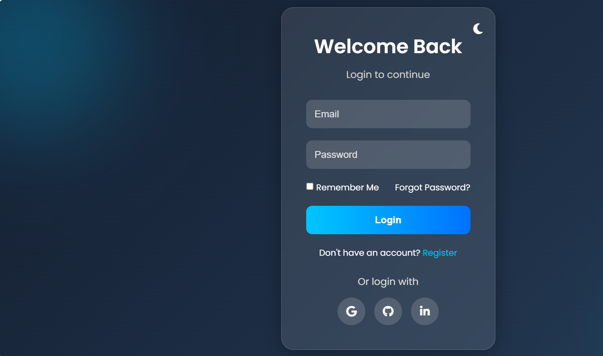
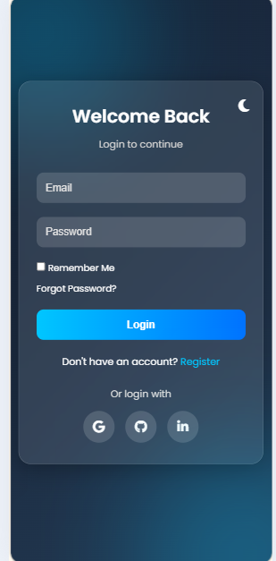

# Modern Login Page

A modern responsive login page built using HTML, CSS, and JavaScript.

## Features

- Glassmorphism UI
- Floating labels
- Dark/Light mode toggle
- Social login buttons
- Responsive design
- Smooth animations
- Modern hover effects

# Technologies Used

- HTML5
- CSS3
- JavaScript

# Screenshots

# Desktop View

### Mobile View

## Live Demo
https://modern-login-page-iota.vercel.app/
 
 Author
Syed Faizan
